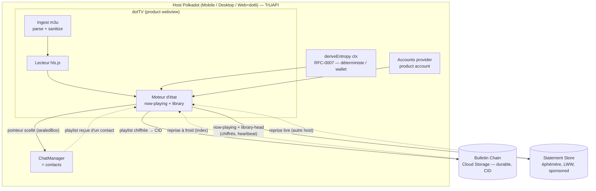

# dotTV — Plan de design
### IPTV décentralisée `.dot` + sauvegarde Bulletin + partage contacts + **continuité inter-hosts**

> Référence des primitives : `paritytech/product-sdk` (monorepo `@parity/product-sdk-*`, Apache-2.0). Toutes les méthodes citées plus bas existent dans le source actuel. Le SDK ne tourne **que** dans un host container (Polkadot Mobile / Desktop / Web=dotli) — `isInsideContainer()` le confirme à l'exécution.

---

## 1. TL;DR

dotTV est un **product** (webview) qui tourne dans le host Polkadot. La lecture IPTV est du pur web (`hls.js` + parseur m3u). Le stockage des playlists est sur le **Bulletin Chain** via `@parity/product-sdk-cloud-storage` (renvoie un CID, immuable, durable). Le partage passe par les contacts du host (`getChatManager()`), avec un pointeur scellé au `sealedBox` vers la clé Curve25519 du destinataire.

**La continuité inter-hosts** (« ouvrir dotTV sur un autre host me remet sur la même chaîne ») est le point neuf. Elle repose sur deux faits :

1. `deriveEntropy(ctx)` (RFC-0007) est **déterministe et lié au wallet** — *même wallet → mêmes octets sur Mobile, Desktop et Web*. C'est l'ancre cross-host pour les clés, le nom de canal et le chiffrement.
2. `ChannelStore` (au-dessus du Statement Store) fournit une sémantique **last-write-wins** : un canal = une valeur, remplacée si plus récente. C'est exactement un état « en cours de lecture ».

→ On publie un petit état `now-playing` chiffré sur un canal dérivé de l'entropie, rafraîchi en heartbeat. À l'ouverture sur n'importe quel host, on lit ce canal et on reprend la chaîne. Le Statement Store étant **éphémère** (512 o/statement, TTL par défaut 30 s), on ajoute une couche durable (index de bibliothèque sur Bulletin + pointeur) pour la reprise à froid.

---

## 2. Mapping exigence → composant (réel)

| Exigence | Composant Parity | Handle concret |
|---|---|---|
| Tourner comme app `.dot` sur Mobile/Desktop/Web | Host Polkadot, dotTV = *product* | `dotNsIdentifier: "dottv.dot"`, `isInsideContainer()` |
| Compte + signature, sans toucher la seed | `@parity/product-sdk-host` (accounts provider), product accounts | `getAccountsProvider()`, `getUserId()`, product account dérivé par le host |
| Lire l'IPTV depuis un m3u (fichier ou URL) | Pur web (pas de chaîne) | `hls.js` + parseur m3u maison/`iptv-playlist-parser` |
| Sauvegarder la playlist | **Bulletin Chain** (Cloud Storage) | `CloudStorageClient.create({ environment: "paseo", signer })` → `.store(bytes)` → CID |
| Relire une playlist | Bulletin via host | `client.fetchJson(cid)` **ou** `getPreimageManager().lookup(cidToPreimageKey(cid), cb)` |
| Partager avec un contact | Contacts du host + scellé | `getChatManager()` (`host_chat_*`) + `sealedBoxEncrypt(ptr, recipientCurve25519)` |
| Clé de chiffrement déterministe cross-host | RFC-0007 | `deriveEntropy(ctx)` → `KeyManager.fromRawKey(entropy)` |
| **Reprise sur la même chaîne entre hosts** | Statement Store (LWW) | `ChannelStore<NowPlaying>` + heartbeat, canal/clé dérivés de l'entropie |
| Soumission sans frais ni signature manuelle | RFC-10 « sponsored » | `createProofAuthorized(statement)` (host signe via `//allowance//statement-store//{productId}`) |

---

## 3. Modèle d'exécution

- dotTV est chargé par le host comme webview. Détection : iframe cross-origin → Web (polkadot.com) ; `window.__HOST_WEBVIEW_MARK__` → Desktop ; `__HOST_API_PORT__` → message-passing desktop.
- Le host fournit : comptes, signer, **product account** (dérivé et scopé à `dottv.dot`), entropie déterministe, Cloud Storage, Statement Store, et le **chat** (= contacts).
- L'identité (`getUserId`) est **la même sur les trois hosts** pour un même utilisateur. C'est l'invariant sur lequel toute la sync repose. On n'a aucune base centrale, aucun compte serveur : l'état « voyage » via la chaîne, pas via un backend dotTV.

---

## 4. Architecture



---

## 5. Flux 1 — Ingestion m3u

1. Source : fichier uploadé **ou** URL `#EXTM3U`. Parsing : extraire par entrée `tvg-id`, `tvg-name`, `tvg-logo`, `group-title`, l'URL du flux et le nom affiché.
2. **Sanitization (sécurité, déjà identifiée comme risque) :** le nom de chaîne et `tvg-logo` sont des vecteurs XSS. N'autoriser que `http(s)` pour les URL de logo/flux ; échapper tout texte injecté dans le DOM ; rejeter `javascript:`/`data:` sur les champs cliquables.
3. Lecture : `hls.js` (flux HLS live, le cas dominant en IPTV). Prévoir CORS : beaucoup de flux nécessitent un proxy ou des en-têtes permissifs — à documenter par flux. La majorité des chaînes m3u sont **live** → la « position » de reprise est le *live edge*, pas un offset (voir §8).

---

## 6. Flux 2 — Sauvegarde sur Bulletin

```ts
import { CloudStorageClient } from "@parity/product-sdk-cloud-storage";
import { aesGcmEncryptPacked } from "@parity/product-sdk-crypto";

// 1. corps de playlist sérialisé (JSON canonique des entrées)
const body = new TextEncoder().encode(JSON.stringify(playlist));

// 2. clé de contenu : soit la clé symétrique dérivée (privé), soit une clé par-partage
const contentKey = keyManager.deriveSymmetricKey(`playlist:${playlistId}`);
const blob = aesGcmEncryptPacked(body, contentKey);   // nonce+ct+tag en un buffer

// 3. autorisation puis store
const client = await CloudStorageClient.create({ environment: "paseo", signer });
const auth = await client.checkAuthorization(address);   // { authorized, remainingBytes, ... }
// (sur testnet géré : autorisation sudo via la Console faucet)
const cid = await client.store(blob).submit();           // CIDv1, immuable
```

Lecture : `await client.fetchBytes(cid)` → déchiffrer avec `aesGcmDecryptPacked(blob, contentKey)`. Variante « via host » : `getPreimageManager()?.lookup(cidToPreimageKey(cid), cb)`.

**Index de bibliothèque** (clé de la durabilité, §8) : un petit doc chiffré
`{ version, playlists: [{cid, title, channelCount, addedAt}], lastPlayed: {...} }`
stocké de la même façon sur Bulletin → `indexCid`. Bulletin est immuable, donc *éditer la bibliothèque = nouvel `indexCid`*. Le « dernier `indexCid` » est la seule partie mutable → traitée en §8.

---

## 7. Flux 3 — Partage avec un contact

Le payload partagé est minuscule : un **pointeur**, pas la playlist.

```ts
import { sealedBoxEncrypt } from "@parity/product-sdk-crypto";

// pointeur = de quoi récupérer + déchiffrer la playlist côté destinataire
const pointer = { v: 1, playlistCid: cid, key: Array.from(contentKey), title };

// scellé vers la clé Curve25519 du destinataire (expéditeur anonyme)
const sealed = sealedBoxEncrypt(
  new TextEncoder().encode(JSON.stringify(pointer)),
  recipientEncryptionPubKey,
);

// livraison via les contacts du host (message custom rendu inline par le host)
const chat = await getChatManager();
await chat?.sendMessage(roomId, { messageType: "dottv/playlist-share", payload: sealed });
```

Côté destinataire : `deriveKeypairs().encryption.secretKey` → `sealedBoxDecrypt(sealed, sk)` → `fetchBytes(playlistCid)` → déchiffrer → la playlist apparaît dans sa bibliothèque.

**Découverte de la clé du destinataire** (seule étape à câbler) : publier sa propre clé Curve25519 publique sur un topic « profil » bien connu (ou l'inclure dans un handshake chat), pour que les contacts puissent sceller vers nous. À spécifier avec l'équipe host (probable que People Chain / le profil host porte déjà un champ).

> Note : le partage par chat est préférable au Statement Store ici (durable, lié à un contact réel, rendu inline). Le Statement Store reste possible mais éphémère.

---

## 8. Flux 4 — Continuité inter-hosts (le cœur)

**Objectif :** ouvrir dotTV sur un host B me remet directement sur la chaîne que je regardais sur le host A.

**Contrainte dure :** le seul stockage *synchronisé et mutable* est le Statement Store, mais il est **éphémère** (`MAX_STATEMENT_SIZE = 512`, `MAX_USER_TOTAL = 1024`, TTL défaut 30 s). Le seul stockage *durable* (Bulletin) est *immuable* (content-addressed). → On combine les deux en **état à deux niveaux**.

### Niveau 1 — Handoff « live » (autoritaire quand frais)

`ChannelStore<NowPlaying>` au-dessus du Statement Store. Un seul canal `now-playing` :

```ts
type NowPlaying = {
  v: 1;
  playlistCid: string;
  channelId: string;     // id stable de l'entrée dans la playlist
  positionMs?: number;   // utile seulement pour VOD/catch-up (live = live edge)
  timestamp: number;     // EN CLAIR — sert au last-write-wins
};
```

- **Canal & clé dérivés de l'entropie** (donc identiques sur tous les hosts et *non devinables* par autrui) :
  ```ts
  const npChannel = `dottv/np/${toHex(await deriveEntropy(enc("dottv/np-channel/v1")))}`;
  const stateKey  = await deriveEntropy(enc("dottv/np-enc/v1")); // clé symétrique 32o
  ```
- **Payload chiffré** : on n'écrit jamais le contenu en clair. Le `timestamp` reste en clair dans l'enveloppe (le LWW en a besoin), le reste est `aesGcmEncryptPacked(JSON, stateKey)`.
- **Heartbeat** : republier `now-playing` toutes les ~15 s pendant la lecture (rafraîchit le TTL), et **immédiatement** sur changement de chaîne / pause.
- **Soumission sponsorisée** : `createProofAuthorized(statement)` → le host signe avec son compte d'allocation, l'utilisateur **ne paie rien et ne signe rien** par update.
- **À l'ouverture (host B)** : `subscribe` → première valeur du canal → déchiffrer → reprendre. Si A et B sont actifs en même temps, `onChange` les garde synchronisés (vrai handoff continu type « Connect »).

**Fuite de métadonnées :** publique mais limitée à « un compte d'allocation a écrit ~200 o sur un canal opaque ». Ni l'utilisateur, ni le contenu, ni la chaîne ne sont identifiables sans `stateKey`.

### Niveau 2 — Reprise à froid / durabilité

Le Niveau 1 s'évapore après TTL → pour le cas « je n'ai pas regardé depuis un jour / nouvel appareil », il faut un point durable.

- **Cache par appareil** — `@parity/product-sdk-local-storage` mémorise le dernier `now-playing` localement. Reprise optimiste instantanée *sur le même appareil*, réconciliée si une valeur Niveau 1 plus récente arrive. (Ne traverse pas les appareils — c'est un fast-path, pas la source de vérité.)
- **Index durable sur Bulletin** — `library-head` : un second canal Statement Store porte `{ indexCid, ts }` (minuscule), avec **TTL long + heartbeat au premier plan et sur timer**, **miroir dans le localStorage**. Sur un appareil neuf au cache vide : lire `library-head` → `indexCid` → `fetchJson(indexCid)` → restaurer playlists + `lastPlayed` → reprendre. Ça résout du même coup « lister mes playlists sur un nouvel appareil » (même problème de pointeur mutable).

### Algorithme de reprise (à l'ouverture, n'importe quel host)

1. `subscribe` aux canaux `now-playing` et `library-head`.
2. Lire le cache local → afficher *immédiatement* la dernière chaîne connue (optimiste).
3. Si une valeur `now-playing` fraîche arrive (d'un host actif) et `ts` > local → basculer dessus (handoff). Charger la playlist via l'index si pas déjà en mémoire, puis tune `channelId`.
4. Sinon (tous les hosts inactifs) → `library-head` → index → `lastPlayed` → reprendre.
5. Réconcilier le cache local.

**Live vs VOD :** pour une chaîne live (cas dominant), « reprendre » = re-tune sur `channelId` au *live edge* ; `positionMs` n'a de sens que pour des entrées VOD/catch-up.

### La seule fragilité honnête

Si **à la fois** le cache local est vide **et** tous les hosts sont restés hors-ligne assez longtemps pour que même le `library-head` à TTL long expire, la reprise à froid dégrade vers « choisis dans tes playlists » (les playlists elles-mêmes restent saines sur Bulletin tant que l'`indexCid` est connu).

**Mitigations :**
- Republier `library-head` à chaque passage au premier plan + timer de fond.
- **Option « cold-start blindé »** : ancrer le pointeur de tête durablement via une écriture on-chain sponsorisée liée au product account (`system.remark` ou une entrée `TransactionStorage`) → durable **et** requêtable par compte, donc un appareil totalement neuf reconstruit depuis la chaîne. Coût : une tx sponsorisée occasionnelle. À activer si l'équipe veut une garantie dure.

---

## 9. Modèle de données (tailles vs limite 512 o)

| Objet | Où | Forme | Taille |
|---|---|---|---|
| Entrée de playlist | dans le corps Bulletin | `{id, name, url, logo?, group?}` | n/a |
| Corps de playlist | Bulletin (chiffré) | `{v, entries: [...]}` | qq Ko–Mo, OK (Bulletin) |
| Index bibliothèque | Bulletin (chiffré) | `{v, playlists:[{cid,title,count,addedAt}], lastPlayed}` | qq Ko, OK |
| `now-playing` | Statement Store (canal, chiffré) | `{v, playlistCid, channelId, positionMs?, ts}` | ~150–250 o ✅ < 512 |
| `library-head` | Statement Store (canal, chiffré) | `{indexCid, ts}` | ~120 o ✅ < 512 |
| Pointeur de partage | Chat (scellé) | `{v, playlistCid, key, title}` | ~200 o + overhead sealedBox |

> Le `now-playing` + `library-head` doivent tenir ensemble sous `MAX_USER_TOTAL = 1024` o. C'est le cas (deux canaux ≈ 350–400 o). Si on ajoute d'autres canaux, surveiller ce budget.

---

## 10. Clés & dérivation (pourquoi `deriveEntropy`, pas `fromSignature`)

- `KeyManager.fromSignature(sig, addr)` dérive une master key par HKDF — **déterministe pour une signature fixe**. Mais les signatures sr25519 sont **non déterministes** : signer deux fois le même message donne deux signatures → deux master keys. Donc `fromSignature` n'est sûr que *single-device après persistance de la master key* (et le localStorage ne traverse pas les hosts). Inadapté au cross-host.
- **Solution cross-host :** `deriveEntropy(ctx)` est déterministe par wallet et identique sur les trois hosts → on le feed dans `KeyManager.fromRawKey(entropy)`. De là :
  - `deriveSymmetricKey(ctx)` → clés de contenu (playlists, état) ;
  - `deriveKeypairs()` → **Curve25519** (réception des partages scellés) + Ed25519.
- Domaines de contexte séparés (`dottv/np-enc/v1`, `dottv/np-channel/v1`, `playlist:<id>`, …) pour ne jamais réutiliser une clé d'un domaine dans un autre.

---

## 11. Risques / questions ouvertes

| # | Risque / question | Sévérité | Piste |
|---|---|---|---|
| R1 | TTL/durabilité du Statement Store insuffisants pour la reprise à froid sur appareil neuf | Moyen | Heartbeat `library-head` + option ancre on-chain (§8) |
| R2 | Découverte de la clé Curve25519 du destinataire pour le partage | Moyen | Topic profil bien connu / champ host ; à confirmer avec l'équipe host |
| R3 | XSS via `tvg-logo` / nom de chaîne | Élevé si non traité | Whitelist `http(s)`, échappement DOM, CSP stricte |
| R4 | CORS sur les flux HLS | Moyen | Proxy/headers par flux ; doc claire pour l'utilisateur |
| R5 | `@novasamatech/host-api-wrapper` volatile (renommé/republié) | Faible–moyen | Passer **par les wrappers `@parity/product-sdk-host`** (déjà fait), pas par novasama en direct ; pin via `pnpm-workspace.yaml` |
| R6 | Budget `MAX_USER_TOTAL = 1024 o` si on multiplie les canaux | Faible | Garder 2 canaux ; sinon fusionner l'état |
| R7 | Conflit handoff si deux hosts écrivent au même instant | Faible | LWW par `timestamp` côté `ChannelStore` (déjà géré) ; clock skew → tolérer, le plus récent gagne |
| R8 | Genesis/preset Bulletin après reset réseau (`ChainNotSupportedError`) | Faible | Catcher l'erreur, re-résoudre le provider host |

---

## 12. Phasage de build

1. **Socle product** — détection host, accounts provider, `dotNsIdentifier`, lecture m3u + `hls.js` + sanitization. *(pur web, aucune chaîne)*
2. **Persistance** — Cloud Storage : encrypt → `store` → CID ; `fetchBytes`/`fetchJson` ; index de bibliothèque.
3. **Continuité Niveau 1** — `deriveEntropy` → clé/canal ; `ChannelStore now-playing` ; heartbeat ; reprise live ; `createProofAuthorized`.
4. **Continuité Niveau 2** — cache local ; `library-head` ; algorithme de reprise complet ; (option) ancre on-chain.
5. **Partage** — `sealedBox` pointeur ; `getChatManager()` message custom + renderer ; réception → bibliothèque ; découverte de clé (R2).
6. **Durcissement** — CSP, CORS, budgets de taille, tests e2e (Playwright), audit des chemins de clé.

---

*Toutes les API référencées proviennent du source actuel de `paritytech/product-sdk` (packages `host`, `cloud-storage`, `statement-store`, `crypto`, `keys`). Le SDK est explicitement marqué « prototype / non audité » par Parity — traiter en conséquence pour toute mise en prod.*
